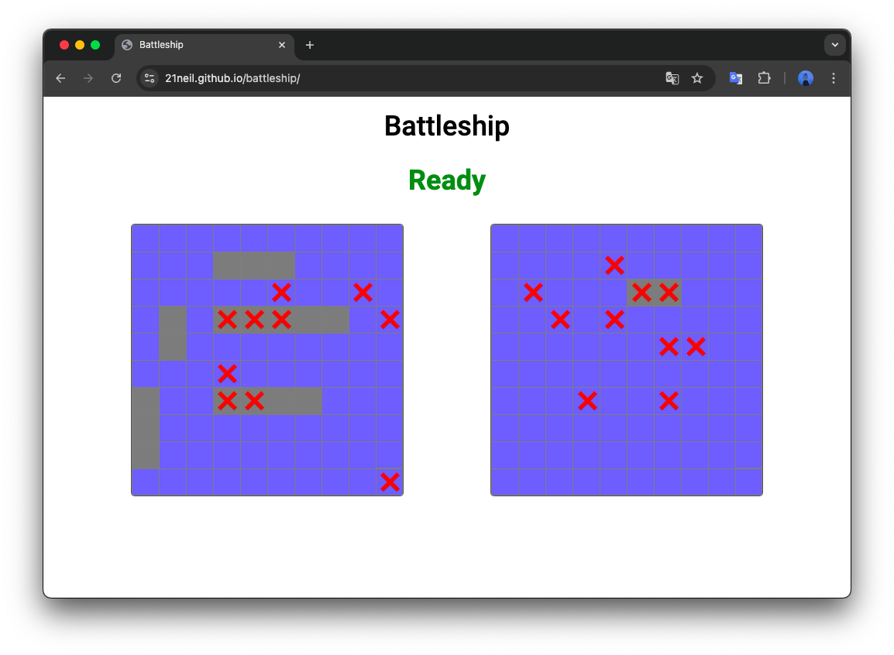

# Battleship

https://21neil.github.io/battleship/

使用原生 JS 開發的經典戰艦遊戲，主要功能使用 TDD（測試區動開發），並使用工廠函式的方式實作各功能，可以選擇跟電腦或玩家對戰。

## 使用說明

1. 提供拖放方式放置船隻
2. 可旋轉船隻方向
3. 可選擇與電腦或是玩家對戰
4. 與玩家對戰採用旋轉螢幕來輪流下棋
5. 其中一方所有船隻擊沉後結束遊戲

## Demo

